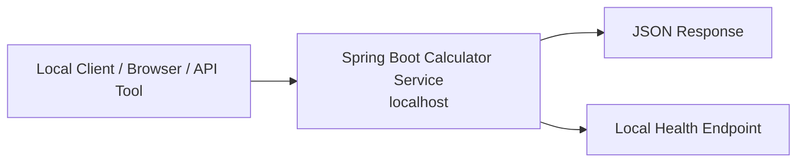

# Calculator Service Architecture v1

## 1. System Overview
The system is a small Spring Boot calculator service that exposes two REST operations: add two numbers and subtract two numbers. It is intended for local testing only, so the architecture prioritizes simplicity, fast startup, and easy verification on a single developer machine.

Core objectives:
- Keep the service stateless and lightweight.
- Run locally without any external server or cloud dependency.
- Provide a minimal REST contract that is easy to test from the same machine.

## 2. High-Level Architecture
The architecture has one runtime component: a Spring Boot application running on localhost. A local client, browser, API tool, or automated test sends requests directly to the service.



## 3. Detailed Request Flow
1. A local client sends a REST request to the calculator service on localhost.
2. Spring Boot receives the request and routes it to the appropriate endpoint.
3. The service validates the request payload and checks that both numeric inputs are present and usable.
4. The service performs the requested arithmetic in memory.
5. The service returns the computed result as a JSON response.
6. If the request is invalid, the service returns a clear 4xx error without exposing internal details.

## 4. Component Design

### Spring Boot Calculator Service
Responsibility: expose the REST endpoints, validate inputs, perform add and subtract operations, and return consistent JSON responses.

Suggested technology: Spring Boot, Spring Web, Bean Validation, Spring Boot Actuator.

Scaling approach: not required for the current scope because the service is local and stateless. If needed later, it can still scale horizontally without state-sharing changes.

### Local Client
Responsibility: send requests to the service and display or assert the response.

Suggested technology: browser, Postman, curl, automated integration tests, or any local HTTP client.

Scaling approach: not applicable.

### Local Observability
Responsibility: provide basic logs and health status for troubleshooting during local runs.

Suggested technology: application logs and Actuator health endpoint.

Scaling approach: not applicable for local testing.

## 5. Data Management
No database is required. The service computes results directly from the request payload and does not persist calculator data.

Storage strategy: none.

Caching strategy: none.

## 6. Scalability Strategy
Scalability is intentionally out of scope for the current local-only version. The service remains stateless, so it can be extended later without redesigning core business logic.

For now:
- Run a single local instance.
- Keep request handling synchronous and simple.
- Avoid introducing shared state or background workers.

## 7. Security Design
For local testing, security requirements are minimal but still practical.

- Bind the application to localhost only.
- Validate numeric inputs and reject malformed payloads.
- Return sanitized error responses.
- Do not expose the service publicly.

Authentication and authorization are not required for the current local-only scope.

## 8. Deployment Architecture
The service runs directly on the developer machine as a Spring Boot process.

- No external server is running.
- No cloud deployment is required.
- No Kubernetes, ingress, or API gateway is needed.
- Access is through a local URL such as `http://localhost:<port>`.

## 9. What Should Be Done ✅
- Keep the service stateless.
- Keep the API surface small and explicit.
- Add basic request validation.
- Provide a health endpoint for local checks.
- Use simple, readable JSON responses.

## 10. What Should Be Avoided ❌
- Avoid external servers or cloud services.
- Avoid databases for this story.
- Avoid queues, background workers, or distributed components.
- Avoid overengineering a two-operation calculator.
- Avoid exposing stack traces or internal implementation details.

## 11. Improvements & Optimizations 💡
- Add OpenAPI documentation if you want easier manual testing.
- Add structured logging if debugging becomes harder.
- Add local integration tests for add and subtract behavior.
- Add correlation IDs only if troubleshooting requires them.

## 12. Failure Handling & Resilience
- Return `400` for invalid or missing input.
- Return `405` for unsupported HTTP methods.
- Return `500` only for unexpected internal failures.
- Keep error payloads small and consistent.

## 13. API Design

### `POST /api/v1/calculator/add`
Description: Adds two numbers.

Request body:
```json
{
  "a": 10,
  "b": 5
}
```

Response body:
```json
{
  "operation": "add",
  "a": 10,
  "b": 5,
  "result": 15
}
```

Status codes:
- `200` successful calculation
- `400` invalid input
- `500` unexpected error

### `POST /api/v1/calculator/subtract`
Description: Subtracts the second number from the first.

Request body:
```json
{
  "a": 10,
  "b": 5
}
```

Response body:
```json
{
  "operation": "subtract",
  "a": 10,
  "b": 5,
  "result": 5
}
```

Status codes:
- `200` successful calculation
- `400` invalid input
- `500` unexpected error

### `GET /actuator/health`
Description: Returns local service health for quick verification.

Response body:
```json
{
  "status": "UP"
}
```

Status codes:
- `200` healthy
- `503` unhealthy

## 14. Database Schema
No database schema is required because the service does not persist data.

If persistence is ever introduced later, a small audit or request log table can be added without changing the calculator endpoints.