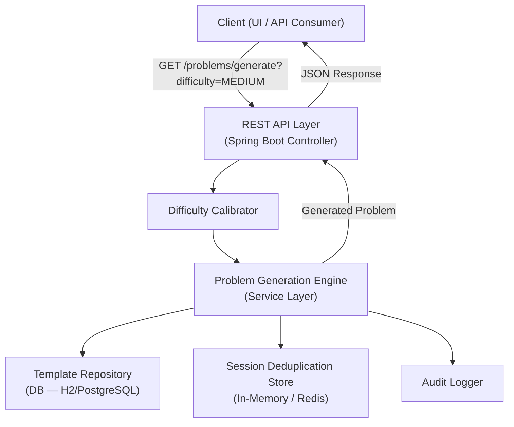

# Architecture Decision — EPMICMPCOD-258

**Ticket:** DSA Generator
**Version:** v1.0
**Status:** APPROVED
**Approved At:** 2026-04-27T12:43:00Z
**Agent:** Architecture Design Agent

---

## 1. System Overview

The **DSA Generator** is a backend system that dynamically generates Data Structures & Algorithms problems tailored to a requested difficulty level (Easy / Medium / Hard). It serves problems to consumers (a frontend UI or an API client) on demand, with configurable categories (arrays, trees, graphs, dynamic programming, etc.) and ensures variety through a generation strategy that avoids repetition within a session.

**Core Objectives:**
- Dynamic problem generation (not static retrieval)
- Difficulty-based filtering and calibration
- Extensible problem category support
- Low-latency API responses
- Stateless, horizontally scalable backend

---

## 2. High-Level Architecture

**Components:**
- **REST API Layer** — Accepts problem generation requests from clients
- **Problem Generation Engine** — Core logic; selects template + parameters based on difficulty
- **Template Repository** — Stores problem templates per category/difficulty
- **Difficulty Calibrator** — Validates and normalises difficulty input
- **Session Deduplication Store** — In-memory (H2/Redis) store to prevent same-problem repetition per session
- **Database** — Persists problem templates, categories, and generation logs



---

## 3. Detailed Request Flow

1. Client sends `GET /api/v1/problems/generate?difficulty=MEDIUM&category=ARRAYS&sessionId=xyz`
2. API controller validates input and delegates to `ProblemGenerationService`
3. `DifficultyCalibrator` normalises difficulty (case-insensitive, enum-bound: EASY/MEDIUM/HARD)
4. Service queries `TemplateRepository` for all templates matching difficulty + optional category
5. `DeduplicationFilter` excludes problem IDs already served to this `sessionId`
6. Engine applies parameterisation (randomises variable names, values, constraints) on selected template
7. Generated problem DTO is returned to API layer → serialised as JSON
8. Audit log entry written asynchronously

---

## 4. Component Design

| Component | Responsibility | Technology | Scaling |
|---|---|---|---|
| REST API Layer | Expose HTTP endpoints; validate requests | Spring Boot + Spring MVC | Horizontal (stateless) |
| Problem Generation Engine | Select template, apply parameters, enforce dedup | Java service class | Stateless; scales with API layer |
| Difficulty Calibrator | Normalise + validate difficulty enum | Utility class | N/A (in-process) |
| Template Repository | CRUD for problem templates | Spring Data JPA + H2/PostgreSQL | DB connection pooling |
| Deduplication Store | Track problems served per session | H2 (dev) / Redis (prod) | Redis cluster for prod |
| Audit Logger | Async logging of generation events | Spring `@Async` + JPA | Decoupled from request path |

---

## 5. Data Management

**Primary DB:** H2 (embedded, dev/test) → PostgreSQL (production)

**Key Tables:**

### `problem_template`
| Column | Type | Notes |
|---|---|---|
| `id` | BIGINT PK | Auto-generated |
| `title` | VARCHAR(255) | Problem title |
| `category` | VARCHAR(50) | e.g. ARRAYS, TREES, GRAPHS, DP |
| `difficulty` | VARCHAR(10) | EASY / MEDIUM / HARD |
| `template_body` | TEXT | Problem statement with placeholders |
| `constraints` | TEXT | Constraint description |
| `expected_complexity` | VARCHAR(50) | e.g. O(n log n) |

### `problem_parameter_set`
| Column | Type | Notes |
|---|---|---|
| `id` | BIGINT PK | Auto-generated |
| `template_id` | BIGINT FK | References `problem_template.id` |
| `param_key` | VARCHAR(100) | Placeholder name |
| `param_value_range` | VARCHAR(255) | Range or set of valid values |

### `generation_log`
| Column | Type | Notes |
|---|---|---|
| `id` | BIGINT PK | Auto-generated |
| `session_id` | VARCHAR(255) | Client-supplied session identifier |
| `template_id` | BIGINT FK | References `problem_template.id` |
| `generated_at` | TIMESTAMP | UTC |
| `difficulty` | VARCHAR(10) | Difficulty used for this generation |

**Caching:** Template list cached in-process via Spring `@Cacheable` (Caffeine). No external cache in MVP.

---

## 6. Scalability Strategy

- API layer is fully stateless → horizontal scaling behind a load balancer
- Session dedup state externalised to Redis for multi-instance deployments
- Template DB reads are read-heavy → add read replica in production
- `@Async` audit logging prevents I/O blocking on request path

---

## 7. Security Design

- Input validation on all API parameters (difficulty enum, category whitelist)
- `sessionId` is client-supplied; treated as opaque, not authenticated in MVP (max 255 chars enforced)
- No PII stored; generation logs contain only `session_id` + `template_id`
- Rate limiting applied at API Gateway / reverse proxy level (not in-app for MVP)

---

## 8. Deployment Architecture

- Single Spring Boot fat JAR (`mvn clean package`)
- Docker image: `openjdk:17-slim` base
- Deployment: single container (MVP) → Kubernetes `Deployment` + `Service` for production
- H2 file-backed DB for dev; PostgreSQL via env-var override for production

---

## 9. What Should Be Done ✅
- Stateless service layer
- Enum-validated difficulty input
- Template-based generation (extensible without code changes)
- Async audit logging
- Deduplication per session

---

## 10. What Should Be Avoided ❌
- Hardcoding problem content in application code
- Synchronous audit I/O on the request thread
- Accepting arbitrary `sessionId` lengths (enforce max 255 chars)
- Storing sensitive data in generation logs

---

## 11. API Specification

### `GET /api/v1/problems/generate`

**Query Parameters:**

| Parameter | Type | Required | Values |
|---|---|---|---|
| `difficulty` | String | Yes | EASY, MEDIUM, HARD |
| `category` | String | No | ARRAYS, TREES, GRAPHS, DP, STRINGS, SORTING |
| `sessionId` | String | No | Opaque client string, max 255 chars |

**Response — 200 OK:**
```json
{
  "problemId": "template-42-session-xyz",
  "title": "Find Maximum Subarray Sum",
  "difficulty": "MEDIUM",
  "category": "ARRAYS",
  "description": "Given an array of n integers...",
  "constraints": "1 ≤ n ≤ 10^5, -10^4 ≤ arr[i] ≤ 10^4",
  "expectedComplexity": "O(n)"
}
```

**Error Responses:**
- `400 Bad Request` — Invalid difficulty value or parameter format
- `404 Not Found` — No templates available for requested difficulty/category combination
- `500 Internal Server Error` — Unexpected generation failure

---

## 12. Key Decisions & Rationale

| Decision | Rationale |
|---|---|
| Template-based generation over AI generation | Deterministic, testable, low-latency, no external API dependency |
| H2 for dev / PostgreSQL for prod | Zero-config dev setup; production-grade DB available via env override |
| Stateless API + externalised dedup | Enables horizontal scaling without sticky sessions |
| `@Async` audit logging | Keeps request latency unaffected by I/O operations |
| Caffeine in-process cache | Avoids Redis dependency for MVP; templates are small and infrequently updated |
